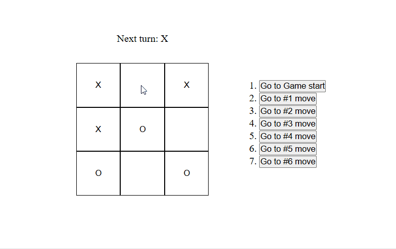

# 🎮 React Tic-Tac-Toe

A simple **Tic-Tac-Toe game** built with **React** and **Vite**.
This project demonstrates core React concepts like **components**, **props**, **state management**, and **conditional rendering** while building a classic two-player game.

---

## 🚀 Features

* ✅ Two-player Tic-Tac-Toe game (X and O)
* ✅ Tracks game history and allows **time travel** (jump back to previous moves)
* ✅ Detects **winner** and **draws**
* ✅ Simple UI with grid-based board
* ✅ Built with **React (Hooks)** and **Vite** for fast development

---

## 🛠️ Tech Stack

* **React** – for UI components and state management
* **Vite** – for fast build and dev server
* **JavaScript (ES6+)**
* **CSS** – for styling the board and layout

---

## 📂 Project Structure

```
├── src/
│   ├── App.jsx        # Main App component
│   ├── App.css        # Styles
│   ├── assets/        # Logos (React, Vite)
│   └── ...
├── index.html
├── package.json
└── README.md
```

---

## ▶️ Getting Started

Follow these steps to run the project locally:

### 1. Clone the repository

```bash
git clone https://github.com/your-username/react-tic-tac-toe.git
cd react-tic-tac-toe
```

### 2. Install dependencies

```bash
npm install
```

### 3. Run the development server

```bash
npm run dev
```

### 4. Open in browser

Visit **[http://localhost:5173/](http://localhost:5173/)** to play the game.

---

## 🎯 How to Play

1. Player **X** always starts first.
2. Players take turns clicking on an empty square.
3. The game announces the winner when a row, column, or diagonal is filled.
4. If all squares are filled with no winner → **Draw**.
5. Use the **move list** on the side to "time travel" to any past game state.

---

## 🎮 Demo 



---

## 💡 Future Improvements

* Add player vs AI mode
* Highlight winning combination
* Improve UI/UX with animations
* Track score across multiple rounds

---

## 📜 License

This project is licensed under the **MIT License**.
Feel free to fork, modify, and use in your own projects.

